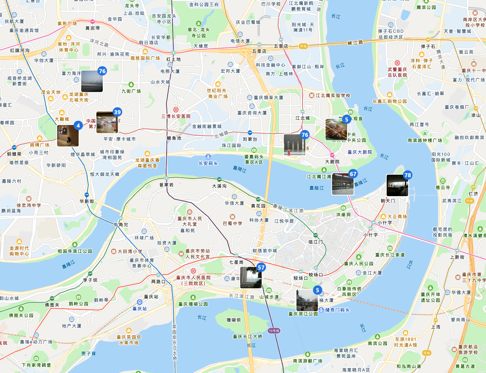
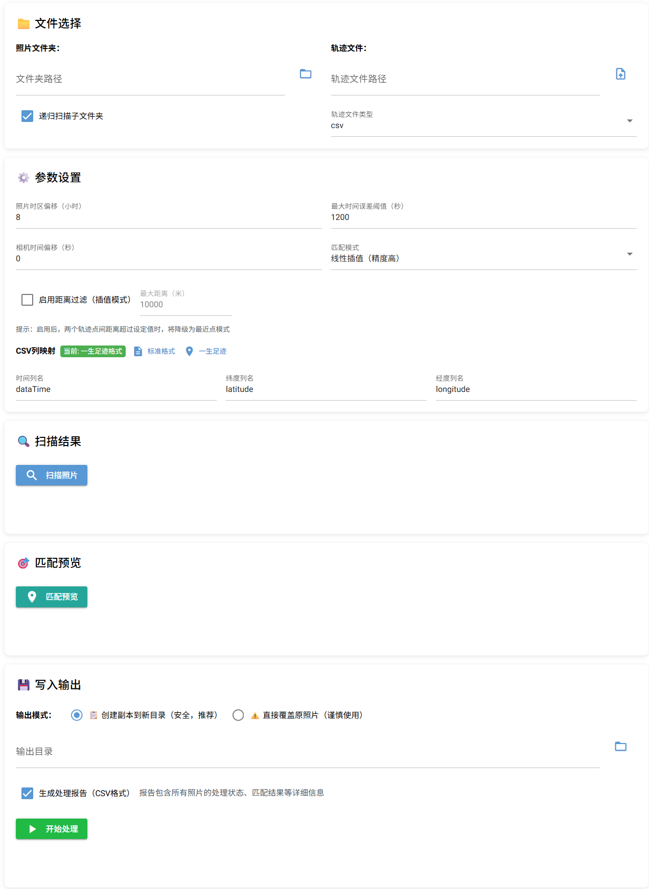
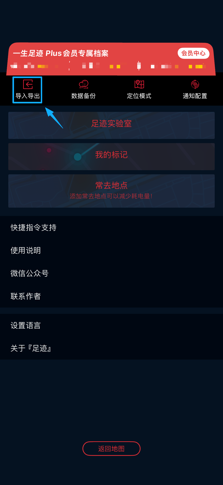
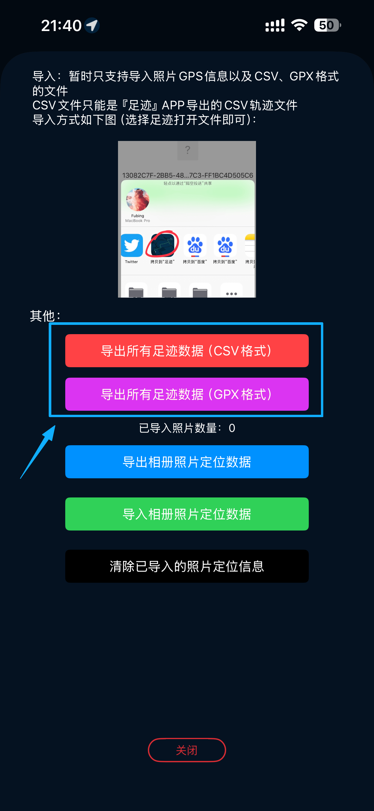

## 📖 简介

**tracklog-to-exif** 是一个**本地离线**运行的照片地理标记工具：解析 GPS 记录软件导出的 **GPX/CSV** 轨迹文件，提取时间与经纬度，并与照片的拍摄时间（EXIF）进行匹配，为**缺少 GPS 信息**的照片写入 **EXIF GPS**。
支持**扫描文件夹**、**仅处理无 GPS 照片**、**匹配预览**、**批量写入**与**导出报告**。

很多相机并不具备 GPS 记录能力；如果你平时使用轨迹记录类手机 App（例如「一生足迹」「世界迷雾」等）导出轨迹文件，就可以用本工具按时间匹配，把定位信息“写回”到相机照片中。
这使得我们使用照片管理软件时可以看到照片所在定位。

---

## ✨ 功能特性

* 📁 选择照片文件夹，自动扫描并分类（已有 GPS / 待处理 / 无时间）
* 🗺️ 支持 GPX / CSV 轨迹文件（来自常见 GPS 记录 App）
* 🎯 按拍摄时间匹配坐标：最近点 / 线性插值
* 💾 默认输出副本，不修改原图
* 📊 自动生成 `report.csv`，可用 Excel 打开查看详情
* 🔒 全程本地处理，照片与轨迹数据不出电脑

---

**界面预览**


---

## 🚀 快速启动

### 1) 安装依赖

```bash
pip install -r requirements.txt
```

### 2) 启动应用

```bash
python app.py
```

### 3) 打开 Web 界面

应用启动后会自动打开浏览器，或手动访问：

```
http://localhost:12138
```

---

## 🧭 使用流程

### Step 1：准备文件

* **照片文件夹**：包含需要添加 GPS 的 JPG/JPEG 照片
* **轨迹文件**：GPX 或 CSV（GPS 轨迹点应包含时间、纬度、经度）

### Step 2：选择路径与类型

在「文件选择」区域填写：

1. 照片文件夹路径
2. 轨迹文件路径
3. 轨迹类型：GPX / CSV

   * 若选择 CSV：设置列映射（例如“一生足迹”：`dataTime / latitude / longitude`）

#### 一生足迹导出数据如下所示：
| Step1                                 | Step2                                 | Step3        |
|---------------------------------------|---------------------------------------|--------------|
|  |  | 导出文件保存到电脑上操作 |

### Step 3：设置参数

在「参数设置」区域配置：

* **照片时区偏移（小时）**：照片拍摄地时区（东八区为 `+8`）
* **相机时间偏移（秒）**：用于校准相机时间不准的问题
* **最大误差阈值（秒）**：匹配允许的最大时间偏差
* **匹配模式**：

  * `nearest` 最近点：更快，适合轨迹点密集
  * `interp` 线性插值：更准，适合轨迹点稀疏（推荐）

### Step 4：扫描照片

点击「扫描照片」后查看分类统计：

* **已有 GPS**：照片 EXIF 已包含 GPS（默认跳过）
* **待处理**：无 GPS 且可读取拍摄时间（将参与匹配）
* **无时间**：无法读取拍摄时间（需手动处理或跳过）

### Step 5：匹配预览

点击「匹配预览」：

* 系统解析轨迹并进行匹配
* 在结果表格中查看每张照片的：

  * 匹配状态、时间误差、lat/lon、匹配方法与备注

### Step 6：开始处理

设置输出目录（默认 `output/`），点击「开始处理」：

* 📷 扫描照片
* 🗺️ 解析轨迹
* 🎯 匹配坐标
* 💾 写入 GPS（输出副本）
* 📊 生成报告

完成后可点击「打开输出文件夹」查看结果。

### Step 7：查看报告

输出目录中包含：

* ✅ **处理后的照片副本**（已写入 EXIF GPS）
* 📄 **report.csv**（详细处理记录与原因）

---

## 📁 输出说明

### 照片输出

* 默认**不修改原始照片**
* 处理后的照片保存在输出目录，文件名保持不变
* GPS 信息写入 EXIF（便于在相册/地图工具中识别）

### 报告 `report.csv`

字段说明：

* `path`：原始照片路径
* `filename`：文件名
* `status`：处理状态

  * `already_gps`：已有 GPS
  * `matched`：匹配成功
  * `too_far`：超过阈值
  * `unmatched`：匹配失败
  * `no_time`：无拍摄时间
* `error_sec`：时间误差（秒）
* `lat` / `lon`：匹配得到的经纬度
* `method`：匹配方法（`nearest` / `interp`）
* `note`：备注（失败原因/边界情况等）

---

## 📦 支持的格式

### 照片

* JPG / JPEG（需要包含 EXIF 信息）
* 支持递归扫描子文件夹

### 轨迹（GPX）

标准 GPX 轨迹点结构示例：

```xml
<trkpt lat="xx.xxxxxx" lon="yy.yyyyyy">
  <time>2024-01-01T12:34:56Z</time>
</trkpt>
```

### 轨迹（CSV）

至少包含三列：时间、纬度、经度，例如：

* `time`：ISO 时间字符串 或 Unix 时间戳（取决于你的实现/配置）
* `lat`：纬度
* `lon`：经度

**“一生足迹”示例**

* 时间列：`dataTime`（Unix 时间戳）
* 纬度列：`latitude`
* 经度列：`longitude`

---

## ⚙️ 参数说明（更易踩坑的重点）

### 照片时区偏移（小时）

* 照片 EXIF 通常只记录“本地时间”，不包含时区
* 例如：北京时间/东八区 = `+8`

### 相机时间偏移（秒）

用于修正相机时间不准（快/慢）导致的整体偏差：

* 设置为 `+30`：表示**把照片时间整体往后推 30 秒**再去匹配
* 设置为 `-30`：表示**把照片时间整体往前推 30 秒**再去匹配

### 最大误差阈值（秒）

* 默认建议：`120` 秒
* 轨迹点越稀疏，可适当增大阈值（但阈值越大，错配风险越高）

### 匹配模式

* `nearest`：找时间最近的轨迹点
* `interp`：用前后两点按时间比例插值（推荐）

---

## 🔒 隐私提示

本工具全程本地运行，不会上传照片或轨迹数据。
但请注意：写入 GPS 后，照片将包含位置信息，分享/上传前请确认是否会泄露隐私。